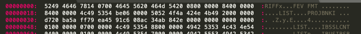
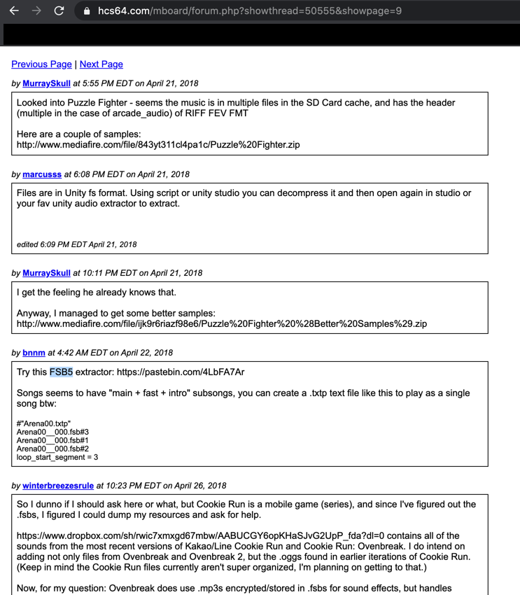

# Bank Robbing
## HSCTF 7 | Forensics
##### @jeffreymeng | June 04, 2020

Problem Statement: 
```
dont do it dont do it dont rob the bank
```
Given File: [BankRobbing](./files/BankRobbing)

-------

Looking at the hex of the file, we see that the magic bytes are 5249 4646.
On https://www.garykessler.net/library/file_sigs.html, we see that this matches a RIFF file of some sort.
Basic resarch and prior knowledge suggests that RIFF files are used for audio/visual data.

At this point, looking at the text representation of the bytes, we also notice that the text representation of the 
first few bytes are RIFFx...FEV FMT.



(sublime text hex viewer)

A quick google search of "RIFF FEV FMT" leads us to this particular forum question (about 8 results down), which is very helpful.
https://hcs64.com/mboard/forum.php?showthread=50555&showpage=9


(screenshot of above forum thread)

First, I tried downloading FMOD Studio, but I couldn't open the file. I also tried opening the file in unity.
Neither of these worked.

This leads us to FSB5 (the 4th item on the thread). Some quick googling reveals that this stands for FMOD Sample Bank.
Because the name of this challenge is `Bank Robbing`, we seem to be on the right track.
A quick search in the bytes of the file reveals that the bytes `4653 4235`, or FSB5, appear somewhere around line 75, at the top of the file.
This also suggests that we are on the right track.


We find a python tool named `python-fsb5`, which seems very helpful. We download it and run it on the BankRobbing file.
We get the following error.

```
Traceback (most recent call last):
  File "extract.py", line 131, in <module>
    main()
  File "extract.py", line 127, in main
    exit(app.run(sys.argv[1:]))
  File "extract.py", line 121, in run
    self.handle_file(f)
  File "extract.py", line 99, in handle_file
    fsb, ext = self.load_fsb(data)
  File "extract.py", line 55, in load_fsb
    fsb = fsb5.load(data)
  File "/Users/xxxxx/Downloads/python-fsb5-master/fsb5/__init__.py", line 230, in load
    return FSB5(data)
  File "/Users/xxxxx/Downloads/python-fsb5-master/fsb5/__init__.py", line 118, in __init__
    raise ValueError("Expected magic header 'FSB5' but got %r" % (magic))
ValueError: Expected magic header 'FSB5' but got b'RIFF'
```

This error suggests that the first few magic bytes were not correct. The script wants the first few bytes to be FSB5. We remeber that the file contains
the bytes `FSB5`, so we can try carving out the file.
Using hexed.it, we can search for those bytes, and try to carve out the file by deleting all the bytes before FSB5. In some cases, we also have to remove the bytes after the file, but it wasn't necessrary for this python tool.
Our new file starts with the bytes 4653 4235, which is the magic header FSB5.

Running this python program gives us a .ogg file. Playing it, the flag is spoken to us.

```
flag{sh4m3_0n_y0u_4_r0bbing_th15_b4nk}
```


