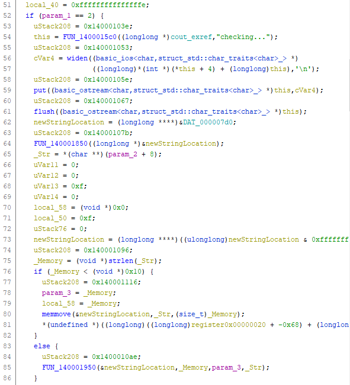
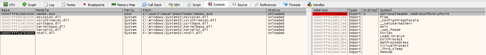
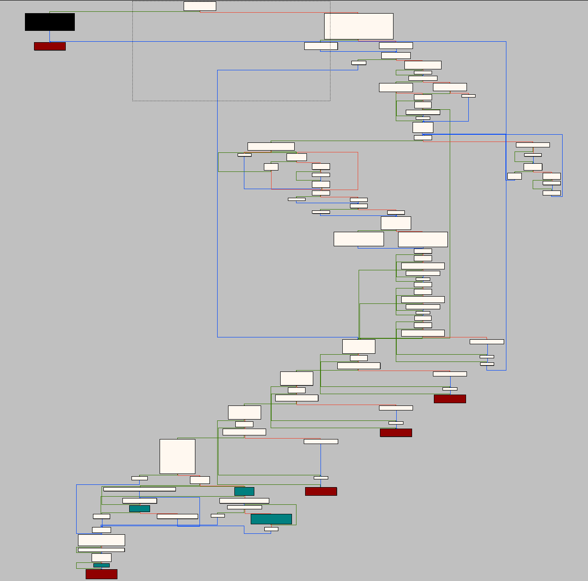
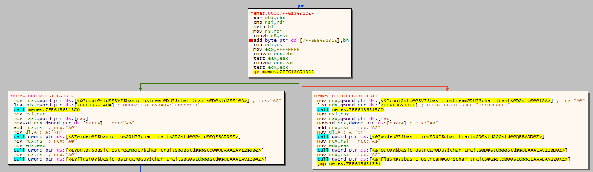

# Generic Flag Checker
## slopey | 6/8/2020

TL;DR: UPX packed binary, unpack for static analysis. Encrypt function is one liner in Python. Scroll down for source.

We are given an executable which encrypts the input and checks it against an encrypted string. Opening the executable in Ghidra, we notice that there are only three functions, all of which, when viewed in the decompiler, look like initialization code. Moreover, when we do a string search, we can't find anything, despite the fact that we know there must be strings in the binary since there is output from the binary when it is run. Inspecting the headers, we find that there's only three headers: `UPX0`, `UPX1`, and `.rsrc`. This tells us the executable is packed using UPX. UPX is a tool which compresses binaries. We can download the toolkit [here](https://github.com/upx/upx/releases/tag/v3.96) and unpack the binary using this command:
```
> upx -d -o memes-unpacked.exe memes.exe
```
Now, opening `memes-unpacked.exe` in Ghidra, we can find all of the functions and see all the normal headers. When we do a string search, we can locate main at the offset `0x1000`. However, when looking at the decompiler and the assembly, we find a lot of junk code.



This is most likely due to the fact that unpacking UPX doesn't always have a 100% accuracy. When I tried running the unpacked binary, it didn't even work. At this point, I chose to use x64dbg to kick off dynamic analysis of the binary. After opening `memes.exe`, I open the symbol tree and find calls to `strlen` and `memcmp`. Most likely, this is part of the actual program logic.



I set a breakpoint at both of those functions. When I hit the breakpoint, I press `Ctrl+F9` which continues until return. I then press `F8` to go to the next instruction so I can see where the function returns to. I hit `strlen` first and return twice, and I am sent to the main function.

Looking at the disassembly, it is exactly the same as Ghidra. It's helpful at this point to graph the function so we can see the control flow diagram. But when we graph the main function on x64dbg, we are faced with this:



Okay, that's not very fun. So let's try to work backwards. I reason that since there's a call to `memcmp`, most likely we'll be given our encrypted input and the encrypted flag. We can work backwards from there to determine what the code does. When we hit the breakpoint, we can take a look at the `RCX` and `RDX` registers to view the parameters. One is likely the flag, and the other is the input. By the way, you can pass a command line argument to x64dbg by running this command:

```
init C:\Users\<Username>\<File Location>, <Command Line Argument #1>, <Command Line Argument #2>, ...
```
Let's execute until return and step to where this function was called from. Inspecting the code on the graph view, we start to understand the binary more:



Great! This makes some sort of sense. We compare the encrypted flag with the encrypted input, and if it's the same, it's correct (and most likely the flag.) Now let's just try to figure out the encryption logic. One way to do this is to try to cheese the problem and just try to pass a bunch of different command line arguments and predict the pattern. If you start to pass in different command line arguments, you'll definetly start to see a pattern. But I was not smart and didn't realize the command line argument was even a string until much later, since I misread the Ghidra decompiler. So at this point, theoretically you don't even need to do any more reverse engineering, and it's also possible to use `angr` or some framework to brute the problem. But for the sake of this writeup, let's just try actually reverse engineering it.

I figured it's going to take me years to figure out what all of this code does, so what I did was that I ran the binary and kept pressing `F8` until I saw the parameter change. That's when I knew the encryption started. The first time this changes is in the very beginning, after a call to memcmp, the first five characters and the last character of the input are chopped off. This was just through basic observation. When you run the binary a few times, you see that this pattern is always there. This actually makes a lot of sense in retrospect. The first five characters it cuts off is most likely `flag{`, and the last character it chops off is most likely `}`. 

After a while, we isolate the main encryption logic to these few lines of assembly:


When you run it a couple of times, it's very obvious what this is doing. `r9b` is initialized as the first character of the sliced input, and `dil` is initialized to zero. Then, this happens:
- The value of `r9b` is decremented by `dil`, which is the counter
- 1 is added to `edi` (so effectively `dil`)
- The next character of the input is moved into `r9b` (FYI, this instruction is not shown in the above image.)

So the Python equivalent of this would be:
```python
def encrypt(plaintext):
  cipher = ""
  for idx, char in enumerate(plaintext[5:-1]):
    cipher += chr(ord(char) - idx)
  return cipher
```
This is easily reversible:
```python
def decrypt(cipher):
  plaintext = ""
  for idx, char in enumerate(cipher[5:-1]):
    plaintext += chr(ord(char) + idx)
  return plaintext
```
We can skip to our breakpoint in `memcmp` and copy the encrypt flag. When we run `decrypt(flag)`, we get our flag.
```
flag{cpp_memes}
```
