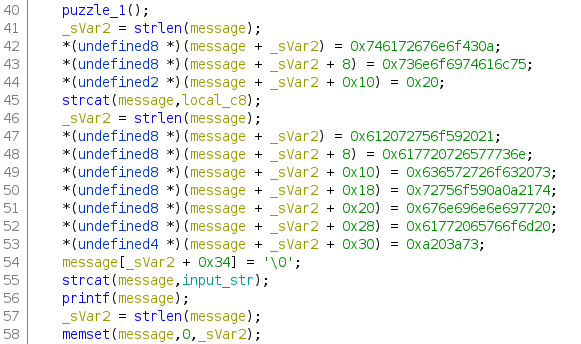
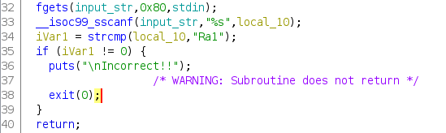
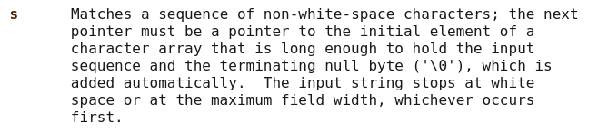

# Queen's Gambit
## slopey | 2/19/2021 | Tenable CTF

We are given a simple application where we must solve three chess puzzles. Security check:
```
[slopey@mariner tenable]$ checksec chess
[*] '/home/slopey/Documents/ctf/tenable/chess'
    Arch:     amd64-64-little
    RELRO:    Partial RELRO
    Stack:    No canary found
    NX:       NX enabled
    PIE:      No PIE (0x400000)
```

# Bug

There are two security vulnerabilities in the file. The first vulnerability was useless to solving the challenge, but I'll talk about it briefly here anyways.

## Format String Bug

When you solve a puzzle correctly, the program outputs the following string:
```
Congratulations <username>! Your answer was correct!

Your winning move was:
<move>
```
Where `username` and `move` is dependent on the username and move you provide. The program does this using a super scuffed method of concatenating each part like so:



As you can see, unsanitized user-controlled input is passed to printf. So, you can set your username to be a format string to get read/write gadget. However, as it turns out this FSB is pretty much useless because you only have 14 characters to spare. Arbitrary write is out of the question. Also, you don't need arbitrary read because there is a hidden function in the binary which grants you shell access. Since PIE is disabled, no leak is needed.

## Buffer Overflow

Let's take a look at the logic used to read in the input for the puzzles. 



This looks like a trivial buffer overflow at first glance. The local variable used to hold user input is only 8 bytes long, and fgets lets us read in 0x80 bytes. However, the problem is that we can't escalate the BOF to RCE because of the strcmp; if the input string isn't equal to the winning move (in this case Ra1), the program exits, and ret is never reached.

The bug is in the use of sscanf, which uses the %s format string. Here is an excerpt from the man page for sscanf:



As you can see, sscanf matches until a whitespace character is reached (since no width field is specified). This means that we can read up to 0x80 bytes into the global variable input_str by simplying passing in the input `Ra1 <whatever payload we want>`. 

fgets reads in 0x80 characters into the input_str, including our payload. sscanf only reads *the first three* characters, Ra1, since after it sees the space, it terminates and *doesn't read in* the payload. We can abuse this logic to simply pass the strcmp exit call, and still manage to get arbitrary input into the global variable. However, as you may have noticed, this is still useless for RCE since the local variable is not overflowed. But there is another bug in the code.

Recall the code snippet from earlier where the FSB was present. As you can see, the global input string is simply concatenated to the message local without a bounds check. Using this, we get RCE.

# Exploitation

Exploitation is *almost* trivial. We can't simply just do `Ra1 <Lots of As><Address of hidden RCE function>` because there is a memset after every printf-- except for the last puzzle.

For the last puzzle, after the printf, there is no memset call, so we can return to any address. But we can't simply just do `Kd2 <Lots of As><Address of hidden RCE function>` either-- there is another catch. strcat concatenates a string until it sees a null byte. This means that we can't have null bytes into our payload. Since the RCE function address is only 3 bytes, we only overflow 4 bytes (3 bytes + 1 null byte strcat adds at the end). The problem is that main returns to a libc function, and all libc functions are 6 bytes. So there is 2 bytes of junk that we don't need.

We can get around this by first overflowing the second puzzle. memset will everything in the stack within the length of the message to be null, *overwriting* the old return address, setting the upper 2 bytes to null. Then, we put our payload in the third puzzle, where there is no memset and we get our flag. The final solve script can be found [here](solve.py)

# Flag

```
flag{And_y0u_didnt_ev3n_n33d_th3_pills}
```
